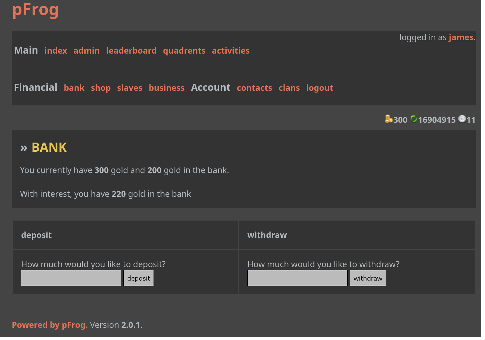

PoshFrog
========
A free game engine, aimed at creating simple web based role playing games.

The project used to be called "pfrog", whihch as ambigram of "free online role playing game". It was one of my very earliest programming projects that was started at latest in 2004, with PHP version 4 at the time. 

The engine was supposed to host a game called "tycoonism", about becoming a tycoon, buying and selling workers, businesses and accessories.

In 2023 I thought it might be amusing to port it to a recent version of PHP, and clean up the code, with the 20 years of coding experience I've developed in the meantime! Allbeit a huge chunk of the code is very legacy. The bulk of it was developed at a time when 56k modems were very common still, XHTMLRequest / AJAX didn't exist, and CSS was version 2 or so.

This project is GPLv2, see the COPYING file.

